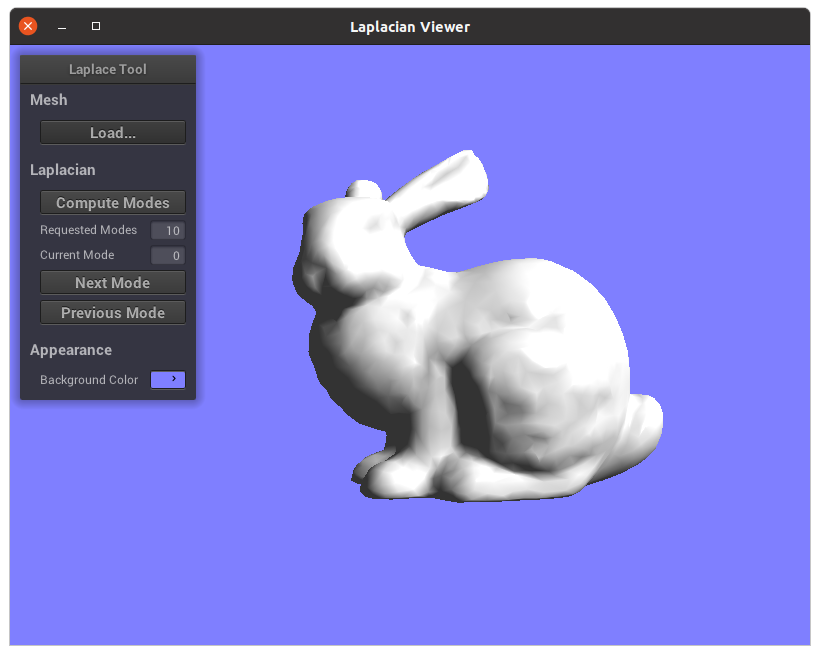
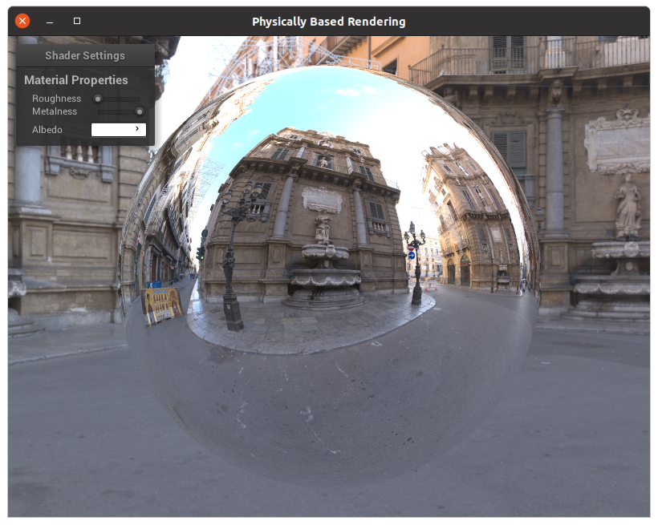
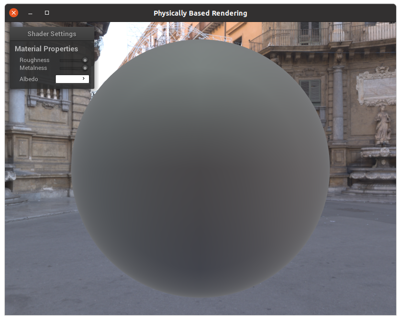

# The Morpheus Graphics Engine

**This is a work in progress. I don't have any impressive tech demos yet, but I've laid most of the ground work now, so more exciting stuff should be comming soon.**

Morpheus is an open source physically-based cross-platform renderer built using OpenGL. It runs on Linux and Windows (in that order of precedence). 

MacOS support is possible, as the engine compiles with clang. But because Apple hasn't updated their OpenGL implementation since 2011, they're still stuck on OpenGL 4.1. I unfortunately make use of a lot of compute shaders which require OpenGL 4.3+. Maybe I'll make a scaled back version of this engine for OpenGL 4.1 someday, but for now, I'm targeting OpenGL 4.5.


It is mostly intended as an academic hobby project of a bored PhD student.

## Current Features

- **Cross Platform**: Write once, deploy everywhere. I hope to fully support Windows, Linux, and MacOS.
- **Scene Graph**: The scene graph is implemented as a bidirected graph. The topology of the graph is stored in a special data structure reminiscent of half-edge, and is stored in a contiguous resizing integer array so that it can be traversed and manipulated efficiently with minimal cache misses. It is possible to create _data views_  from the bidirected graph, which specify attributes of the vertices or edges of the graph. By default, an engine node data view is always created that stores the node type enum of each vertex as well as a pointer to the owner (i.e., the object the vertex represents, e.g., geometry, texture, shader, etc.) of each vertex.
- **Scene Management** (_In Progress_): I hope to have different types of scene management --- hopefully some mix of BVH for static outdoor environments, portals for static indoor environments, and fast spatial hashing for dynamic objects. This is low priority at the moment.
- **Resource Management**: Everything in the engine is part of the scene graph, and there are resource management routines to isolate parts of the scene graph that have been orphaned (i.e., do not appear in any active scenes or are not actively in use by engine components like the renderer) and destroy them and their associated resources. This resource management is primarily handled by the **ContentManager** class (in _content.hpp_), which can periodically search and deallocate any nodes that have been orphaned via the **ContentManager::collectGarbage** method. The ContentManager can also be used to load the following types of files:
    - **Textures**: .ktx and .dds textures can be loaded directly into OpenGL. I recommend these formats because they store mipmaps, and can also be used for other texture types beyond the standard 2D texture (e.g., cubemap). However, there is also limited support for loading 2D textures from .png files and loading cubemaps from .png files.
    - **Static Meshes**: Currently static geometry can be loaded into the engine via the assimp library. I support any geometry format that assimp supports.
    - **Shaders and Shader Preprocessor**: Shader programs are specified via .json files that include paths to the shader source code, default parameters for uniforms, default resource paths for textures, as well as other types of metadata. I have implemented a basic shader preprocessor that allows use of #include statements.
    - **Materials**: In my engine, materials are implemented as .json files that override the default uniform/texture assignments of shader programs. Materials can be duplicated/modified at engine runtime.
    - **Half-Edge Geometry** (_In Progress_): I also support the loading of meshes into half-edge format. Currently, the meshes are loaded via assimp and then converted into half-edge. This works for most meshes I've tried it on, but some meshes don't work. Use with caution I guess.
- **Mesh Laplacians**: If provided with half-edge geometry, the engine can compute Laplacian of a mesh as a sparse matrices (see _meshlap.hpp_).
- **Physically-Based Forward Renderer** (_In Progress_): I'm implementing a physically-based forward renderer that traverses a part of the scene graph and outputs a rendered image with OpenGL. The lighting model is based off of [the lighting model in Unreal Engine 4](https://cdn2.unrealengine.com/Resources/files/2013SiggraphPresentationsNotes-26915738.pdf).
    - The lighting model uses the Cook-Torrance model to compute specular reflections and the Lambert model to compute diffuse lighting.
    - Direct lighting is handled via direct evaluation of the Lambert and Cook-Torrance kernels.
    - Single bounce indirect lighting is handled via _light probes_, which are precomputed and filtered into:
        - Diffuse irradiance maps via [a transformation in the spherical harmonics basis](https://cseweb.ucsd.edu/~ravir/papers/envmap/envmap.pdf). Only the first 9 coefficients are stored for the diffuse irradiance.
        - A pre-convolved environment map via Monte Carlo sampling of the [GGX distribution](http://www.cs.cornell.edu/~srm/publications/EGSR07-btdf.html).
    - Other features that will eventually make it in:
        - Frustum and portal culling.
        - Level of detail.
        - Ambient occulsion.
        - Cascaded shadow mapping.
- **Scene Editor** (_In Progress_): I'll get to this one day.
- **Material Editor** (_In Progress_): Likewise.

## Dependencies

Currently, I have the following dependencies. They are all included a recursive git clone, except for the first two.

- **OpenGL**: Used to render stuff. I'm targeting version 4.5. _Please install seperately_
- **GLFW**: Used to handle windowing and swapping of front and back buffers. _Please install seperately_
- **GLAD**: Used to load all OpenGL functions and extensions.
- **nanogui**: A very nice gui library to handle user interaction.
- **assimp**: Used to load geometry into the engine.
- **Eigen**: Used for large matrix calculations. Currently the indirect lighting and spherical harmonics code uses it.
- **glm**: Used for 2d, 3d, and 4d vector calcaluations.
- **gli**: Used to load .ktx and .dds textures into the engine.
- **lodepng**: Used to load .png textures into the engine.
- **nlohmann/json**: Used to load .json files for configuration of the engine.
- **spectra** (_optional_): If you want to build the Laplacian eigenvector stuff, you'll need this to compute eigenvectors.
- **cmake**: Used as the build system.

## Building

The build system is cmake, and it hopefully shouldn't be hard to build if you recursively clone the github repo, as all the dependencies are already included as git submodules.

### Linux

On Linux, please use **gcc** as your compiler. I've only tested under Ubuntu, so I'm not sure if it will compile under other distros.

### MacOS X

On MacOS X, please use **clang** as your compiler. There is some Mac specific UI stuff that won't compile correctly using gcc.

### Windows

I don't really like Windows. But I assume that it will compile fine with **msvc**, probably.

### Instructions

First clone the repo, i.e.,

```bash
git clone --recursive [url]
```

Then change directory into Morpheus,

```
cd Morpheus
```

Note that you will need to do an in-source build of assimp first to get the engine to work. This is because assimp's build process writes a config.h file to the include/ directory that the engine uses.

```bash
cd assimp
cmake .
make
cd ..
```

Now, create a build directory and build the entire engine and all dependencies,

```bash
mkdir build
cd build
cmake ..
make all
```

One thing to note is if you are building with the cmake extension for VSCode, it is useful to have different output directories for different build configurations:

```json
"cmake.buildDirectory" : "${workspaceRoot}/build/${buildType}"
```

### Running in VSCode under Linux

I use VSCode as my development environment, and I prefer to work on Linux.

However, in Linux, the environment variable $DISPLAY must be set because GLFW uses it to spawn a window and graphics device from an X11 display server. You can add the following code to your .bashrc:

```bash
if [ -z "$DISPLAY" ]
then
        export DISPLAY=":1"
fi
```

And then you can set the following in your VSCode config:

```json
"terminal.integrated.shellArgs.linux": ["-l"]
```

This will force VSCode to open its terminal as a login terminal, and run your .bashrc when it starts up.

## Documentation

Currently, there's not much. I'll make some if I ever get around to it.

# Current Examples

## lapviewer

An example that displays both nanogui and assimp integration as well as the mesh laplacian functionality of the engine. You can load a mesh using assimp, and display that mesh. Afterwards, you can compute the first k eigenmodes of the mesh laplacian. These modes will then be displayed on the mesh.




## pbr

An example that shows how to implement PBR using the engine's built in tools for computing Lambert and GGX convolutions on the GPU as well as pre-integrating the Cook-Torrance BRDF via quasi Monte Carlo on the GPU.

```c++
Texture* tex = getFactory<Texture>()->loadGliUnmanaged("content/textures/skybox.ktx", GL_RGBA8);

auto lambertKernel = new LambertComputeKernel();
auto ggxKernel = new GGXComputeKernel();
auto lutKernel = new CookTorranceLUTComputeKernel();

...

// Submit a compute job to the lambert kernel
LambertComputeJob lambertJob;
lambertJob.mInputImage = tex;
lambertKernel->submit(lambertJob);

// Submit a compute job to the ggx kernel
GGXComputeJob ggxJob;
ggxJob.mInputImage = tex;
Texture* specularResult = ggxKernel->submit(ggxJob);

// Create a lookup texture with the BRDF kernel
Texture* brdf = lutKernel->submit();

lambertKernel->barrier();
ggxKernel->barrier();
lutKernel->barrier();

unload(tex);

// Access SH coefficients using lambertKernel->results()
```
The implementation is based on these two papers:

*  Diffuse irradiance maps via [the technique in this paper](https://cseweb.ucsd.edu/~ravir/papers/envmap/envmap.pdf).
* A specular environment map via [the technique used by Unreal Engine 4](https://cdn2.unrealengine.com/Resources/files/2013SiggraphPresentationsNotes-26915738.pdf).

#### PBR Example: A smooth dialectric


#### PBR Example: A nonsmooth dialectric


### PBR Example: A smooth conductor



### PBR Example: A nonsmooth conductor



## compute-test

Shows how to load a compute shader with the content manager, write the result of the compute shader into a texture, and then blit that texture to screen. Displays an animation of the Mandelbrot fractal.


## blit-test

Shows how to load a texture and blit the result to screen using the renderer's debug functionality.

## simple-app

An easy hello world for the engine. Creates an empty scene and uses the renderer to display it.